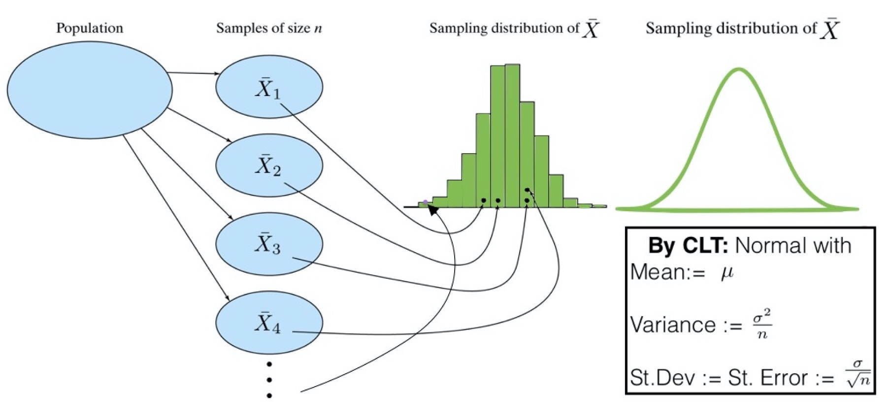
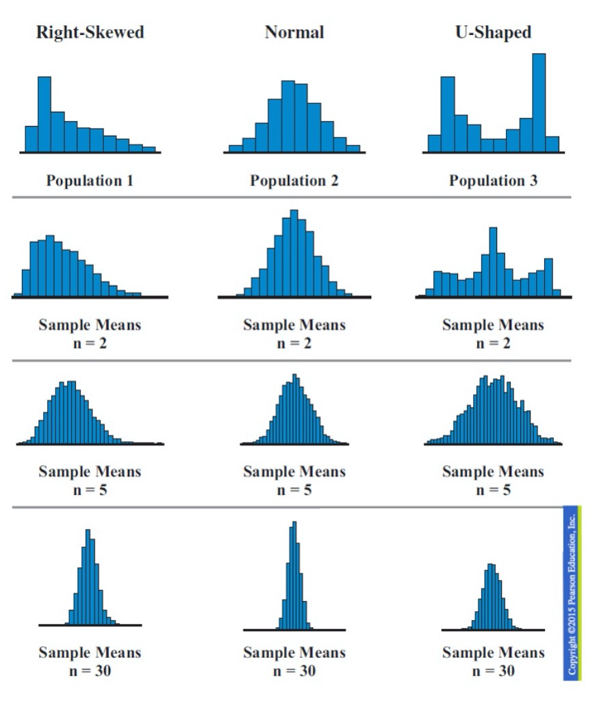
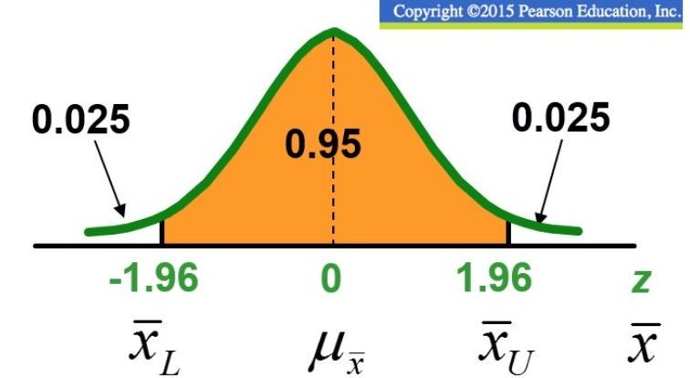

## The Sampling Distribution of Sample Means

* The sampling distribution of sampling describes the pattern that sample means follow
    + Say you take 50 samples from a population and take the mean of each of 
    those 50 samples. If you create a histogram using all of the sample means 
    as your data points, this would be your sampling distribution.

* Sufficiently large
    + If the population that you draw your samples from follows a **normal**
    distribution, then the sampling distribution will **also follow the normal
    distribution.**
    + If the size of the samples are **greater than 30 (a.k.a. sufficiently
    large)**, then the sampling distribution will be** normally distributed
    regardless of the shape of the population distribtion.**
    

## The Components of the Sampling Distribution

### Mean

* The mean of the sampling distribution is the same as the population mean, in 
other words $\mu_{\bar x} = \mu$

### Standard Error

* The standard error is simply **the standard deviation of the sampling 
distribution of sample means.**
    + Standard error = $\sigma_{\bar x} = \frac{\sigma}{\sqrt{n}}$
    + **This is often confused with sampling error, make sure you know the 
    difference!**
    
## Finding Probabilities

* This is very similar to what we did on last weeks homeworkm except now we are
**using the sampling distribution**.
    + This means we use the standard error when calculating probabilities
    + Make sure you know which to use when solving problems!!

## Testing Claims

* We can calculate confidence intervals using the sample mean, critical value,
and standard error to validate a claim.
    + Generally, if the population mean falls within an interval, this means
    that the claimed population mean is a reasonable value.
    + If it is outside the interval, it's an unusual observation 

* $[\bar x - z\sigma_{\bar x}, \bar x - z\sigma_{\bar x}]$
    + **Lower**: $\bar x - 1.96\frac{\sigma}{\sqrt{n}}$
    + **Upper**: $\bar x + 1.96\frac{\sigma}{\sqrt{n}}$
    

## What affects confidence interval width?

* If you can't remember, think about how the margin of error is calculated
    + $ME = CV \times \frac{\sigma}{\sqrt{n}}$

* What happens to the width of the interval when the level of confidence is
increased?
    + When confidence level is increased, the interval becomes wider. The 
    picture above has a 95% level of confidence. If it becomes 99%, The orange 
    area grows wider, subsequently making the critical values larger in 
    magnitude. This makes our calculation larger, since this increases the size
    of the margin of error.
    
* What happens to the width of the interval when the standard deviation
increases?
    + When the standard deviation grows larger, this will also widen the margin
    of error since it is in the numerator of the standard errror.
    
* What happens to the width of the interval when the sample size increases?
    + Since the sample size is in the denominator of the standard error, this
    is going to make the width smaller as n grows larger. 

  

