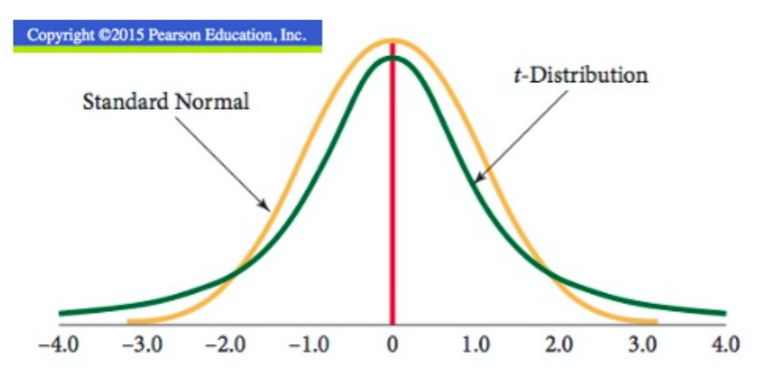
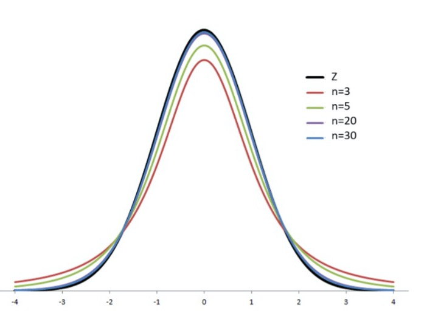

+ Will we ever know the true population standard deviation?
    + Probably not. (why?)
    
+ When $\sigma$ is not known, what can we do?
    + Change the sampling distribution of sample means
    + Make an adjustment to the standard error
    
## Changing the Sampling Distribution

- Before, the sampling distribution of sample means was normal because we knew
$\\sigma$.
- Now, we don't know sigma, so we can't use the normal, and now have to use the
**t-distribution**

## Adjusting the standard error

- When we were working with the normal, the standard deviation of the sampling
distribution was called the **standard error**
    - $\frac{\sigma}{\sqrt{n}}$

- Since we are now working with the t-distribution, we have to adjust the SE
    - $\hat\sigma_{\bar x}\frac{s}{\sqrt{n}}$, where $s$ is the **sample** 
    standard deviation.
    
## What is the t-distribution?

- The t-distribution looks extremely similar to the standard-normal 
distribution.
    - More area in the tails, and less area in the center (wider overall)
    - Degrees of freedom (n-1)
        - **When making calculations, it is extremely important to use the 
        correct degrees of freedom.** 
        - Degrees of freedom describes the shape of the distribution, and you 
        will get different answers if you use a different n.
        - For example, if you were calculating the area of a portion of a 
        circle, you would get different values depending on the radius.
        

### When can you use the t-distribution?

- When population distribution is normal
- When the population distribution is not extremely skewed and sample size is 
sufficiently large
- **Cannot** be used when the population distribution is skewed or sample size
is small.

### How does this affect confidence intervals

- Standard error uses the sample standard deviation $s$ instead of $\sigma$
- Critical values are calculated using the t-distribution with n-1 degrees of
freedom

- $\bar x \pm t_{\alpha/2, n-1}\frac{s}{\sqrt{n}}$

## What affects confidence interval width?

* Think about how the margin of error is calculated
    + **Normal:** $ME = z_{\alpha/2} \times \frac{\sigma}{\sqrt{n}}$
    + **t:** $ME = t_{\alpha/2, n-1} \times \frac{s}{\sqrt{n}}$

* What happens to the width of the interval when the level of confidence is
increased?
    + When confidence level is increased, the interval becomes wider. The 
    picture above has a 95% level of confidence. If it becomes 99%, The yellow 
    area grows wider, subsequently making the critical values larger in 
    magnitude. This makes our calculation larger, since this increases the size
    of the margin of error.
    
* What happens to the width of the interval when the standard deviation
increases?
    + When the standard deviation grows larger, this will also widen the margin
    of error since it is in the numerator of the standard error.
    
* What happens to the width of the interval when the sample size increases?
    + Since the sample size is in the denominator of the standard error, this
    is going to make the width smaller as n grows larger. 

  

