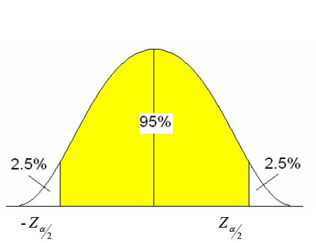

# Confidence Intervals for the Mean

- Remember the CLT:
    - When the CLT applies, the sampling distribution of sample means is normal.
    - The mean of the sampling distribution, $\bar x$, is the same as the population mean, $\mu$.
    - It is **very difficult** to measure an entire population, so we never really know $\mu$.
    - How can we estimate $\mu$ without knowing it?

## Point Estimates 

* A point estimate is a statistic (like the sample mean) which is used as a best guess for $\mu$.
* We don't know how accurate this is though (think about how sampling error is calculated).

## Interval Estimates

* An interval estimate gives an upper and lower boundary for potential values of the population parameter
    * Centered around our point estimate.
    * We know the probability that the population parameter is included in our interval, which is also the specified confidence level.
        
## How is an interval constructed?

* There are a few things we have to calculate:

1. **Sample mean:** The mean of the sample.
2. **Standard error:** This is the standard deviation of the sampling distribution.
    - $\frac{\sigma}{\sqrt{n}}$, where $\sigma$ is the population standard deviation.
3. **Critical Value:** The upper and lower boundary of our interval.
    * First calculate $\alpha = 1 - \text{confidence level}$.
    * Plug into NORM.S.INV($1 - (\alpha/2))$. What is this doing?
4. **The Margin of error:** This is the values to the right of the $\pm$ sign in the interval, which is just $z_{\alpha/2}\frac{\sigma}{\sqrt{n}}$.
5. The interval is then $[\bar x - z_{\alpha/2} \frac{\sigma}{\sqrt{n}},\bar x + z_{\alpha/2} \frac{\sigma}{\sqrt{n}}]$
        
### Quick Example: Finding the CVs for a 95% CI

Say we are calculating the critical value for a 95% confidence interval. 

1. $alpha = 1 - 0.95 = 0.05$. 
    - This makes sense because this is the area under the curve not in out interval. 
    
2. Plug in NORM.S.INV($1 - (0.05/2))$. 
    - We divide by two because we have to split the area in the tails. 
    
3. This returns the upper value for $z_(\alpha/2)$
    - How would you find the lower value?

## What affects confidence interval width?

* Think about how the margin of error is calculated
    + $ME = z_{\alpha/2} \times \frac{\sigma}{\sqrt{n}}$

* What happens to the width of the interval when the level of confidence is
increased?
    + When confidence level is increased, the interval becomes wider. The 
    picture above has a 95% level of confidence. If it becomes 99%, The yellow 
    area grows wider, subsequently making the critical values larger in 
    magnitude. This makes our calculation larger, since this increases the size
    of the margin of error.
    
* What happens to the width of the interval when the standard deviation
increases?
    + When the standard deviation grows larger, this will also widen the margin
    of error since it is in the numerator of the standard error.
    
* What happens to the width of the interval when the sample size increases?
    + Since the sample size is in the denominator of the standard error, this
    is going to make the width smaller as n grows larger. 