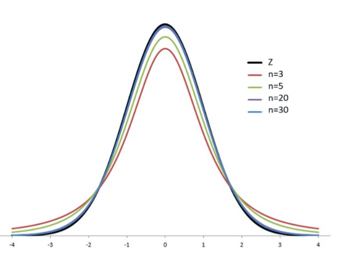
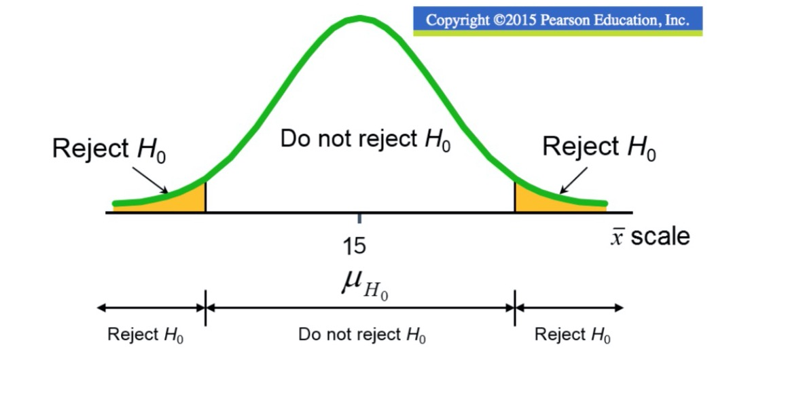
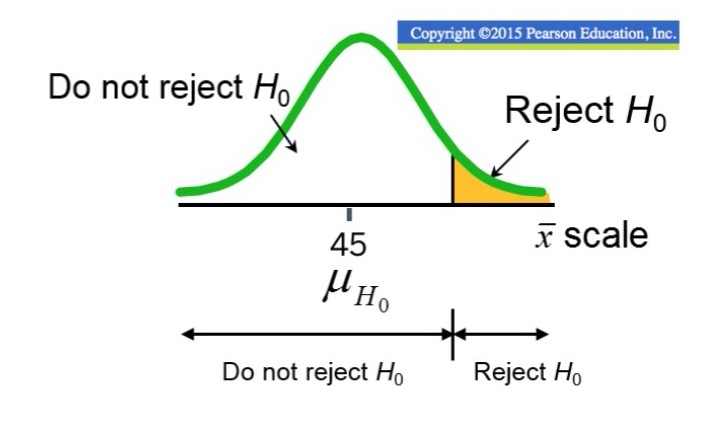
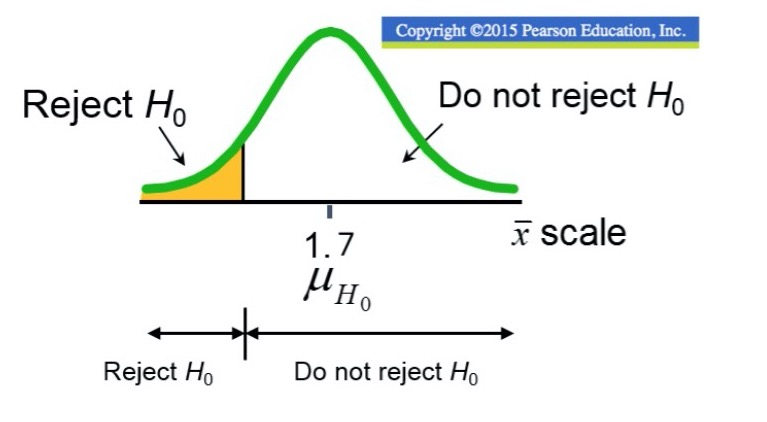

# Hypothesis Testing

* Hypothesis Tests consider the plausability of a specific claim (which are called hypotheses)

## What are the hypotheses?

* Null hypothesis
    - Receives the benefit of the doubt

* Alternative
    - Carries the burden of proof, meaning we need to evidence to confirm or reject a claim.
    
### Ex: Innocent until proven guilty

* In the court system, you always assume someone is innocent
* Evidence is compiled and a case is made
* If there is enough evidence to show the person is guilty, then they're no longer innocent.
* In hypothesis testing, **ALWAYS ASSUME THAT YOU ARE WRONG**, more on this later in the practice problems

## Using the t-distribution
+ Will we ever know the true population standard deviation?
    + Probably not. (why?)
    
+ When $\sigma$ is not known, what can we do?
    + Change the sampling distribution of sample means
    + Make an adjustment to the standard error

+ Before, the sampling distribution of sample means was normal because we knew
$\\sigma$.

+ Now, we don't know sigma, so we can't use the normal, and now have to use the
**t-distribution**

## What is the t-distribution?

- The t-distribution looks extremely similar to the standard-normal 
distribution.
    - More area in the tails, and less area in the center (wider overall)
    - Degrees of freedom (n-1)
        - **When making calculations, it is extremely important to use the 
        correct degrees of freedom.** 
        - Degrees of freedom describes the shape of the distribution, and you 
        will get different answers if you use a different n.
        - For example, if you were calculating the area of a portion of a 
        circle, you would get different values depending on the radius.
        

### When can you use the t-distribution?

- When population distribution is normal
- When the population distribution is not extremely skewed and sample size is 
sufficiently large
- **Cannot** be used when the population distribution is skewed or sample size
is small.

## Types of tests

### Two-tailed tests

$H0: mu = 15$

$H1: mu \neq 15$

* Very important to remember that the rejection regions have an area of $\alpha/2$.

* If the test statistic we calculated falls in either rejection region portion, 
we can reject the null.

### One-tailed tests

* The rejection regions have an area of $\alpha$, regardless of the sign.

#### Upper

$H0: mu <= 45$

$H1: mu > 45$

* If the test statistic we calculated falls in the rejection region in the upper
portion, we can reject the null.

#### Lower

$H0: mu >= 1.7$

$H1: mu < 1.7$

If the test statistic we calculated falls in the rejection region in the lower
portion, we can reject the null.

## P value

* This is the probability that a test statistic (which in our case is a sample
mean) is at least as extreme as the one we just observed, **ASSUMING THE NULL HYPOTHESIS IS TRUE**.
    - If the p-value is less than our specified alpha, we can reject the null 
    hypothesis.
    - This means that if the null hypothesis was actually true, we just 
    calculated a sample mean that has **an extremely low chance of happening.** 
    So this means that the null hypothesis is probably incorrect.
    
## Setting up a test

* Figure out your hypothesis (i.e. what are you trying to find evidence for?)
    - If the problem says to counter a claim, assume you are wrong and write the
    claim you're trying to counter as the null hypothesis. 
    - Look for words that indicate direction, like "the company believes they sell 
    more than 10 apples a day." If we are to counter their claim, we need evidence
    to show that they actually sell less than 10, which is our alternative.
    - If there are no statements about direction OR if it says "different", it's
    a two-tailed test.

  

