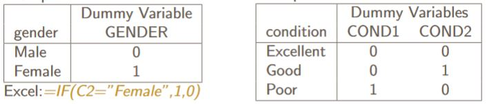

## Goal:

Using multiple predictor variables to predict some outcome $\hat y$.

## Equation for multiple regression

$$y = \beta_0 + \beta_1X_1 + \beta_2X_2 + \dots + \beta_kX_k + \epsilon, \epsilon \sim N(0, \sigma^2_\epsilon)$$

- This differs from simple linear regression because now we have multiple predictor variables, 
as well as multiple inputs for data. 

- Each $\beta_j$ represents the population slope coefficient for the jth predictor
    - This is the average change in y for a unit change in $x_j$ with **all other predictors held constant.**
    

- Here the response variable is earnings per share (EPS)

- For example, increasing ROAA by 1%$ results in a 1.0893 unit increase in EPS

## Hypothesis test for overall model significance

- We can test to see if the overall model is significant
    - In other words, is there a linear relationship between the response and the predictors?
    
$$H_0: \beta_1 = \dots = \beta_k = 0$$

$$H_1: \text{at least one }\beta_j \neq 0$$

- All that we need is for one predictor to have a significant relationship with thew response.

- This is called an F-Test
    - The test statistic is found in the middle table of the regression output in Excel
    - The p-value is found right next to that.
    
## The Adjusted Coefficient of Determination

- Remember $R^2$: the amount of variation in $y$ explained by $x$. 

- Adding more variables into the model will always result in an increase of $R^2$
    - This does not mean to throw every variable into the model
    - Some variables don't add any more information and only further complicate the model.

- Adjusted $R^2$ is a measure that balances the cost of adding a variable with the benefit
of the addition to $R^2$ 
    - Adjusted $R^2$ is less than $R^2$ 
    - Adding variables into the model may decrease adjusted $R^2$.
    - It is used in model selection to find the “best” model; i.e., the one with enough variables but not too many
    
## Qualitative Independent Variables

- It is possible to add in qualitative variables, like gender or color.
    - This is done using dummy variables
    

- This creates a "baseline level"
    - The slope coefficient represents the change from going to baseline to other variable

## Multicollinearity

- This occurs when two variables are highly correlated with one another

- Some problems that multicollinearity causes:
    - Redundant variables in the model
    - Significant independent variables appear not as significant
    - Difficulty with interpretating the regression coefficients

- If the sign on an independent variable seems wrong, suspect multicollinearity

- Measures to detect multicollinearity:
    - The variance inflation factor (VIF): A VIF of 5 or more indicates multicollinearity (VIF= 1 if no correlation between x’s)
    - Correlation matrix of independent variables shows high correlation

- Eliminate multicollinearity by removing one or both the offending independent variables

## Model Building

- It is important to create the regression model that contains the most effective predictor variables

### Backward elimination regression

1. Begin the process with all of the independent variables in the model
2. Remove the variable with the largest p-value. This variable can never come back into the model.
3. No guarantee that the final model will find the group of variables that provides the highest possible adjusted $R^2$.
4. Repeat until all predictors are significant.

